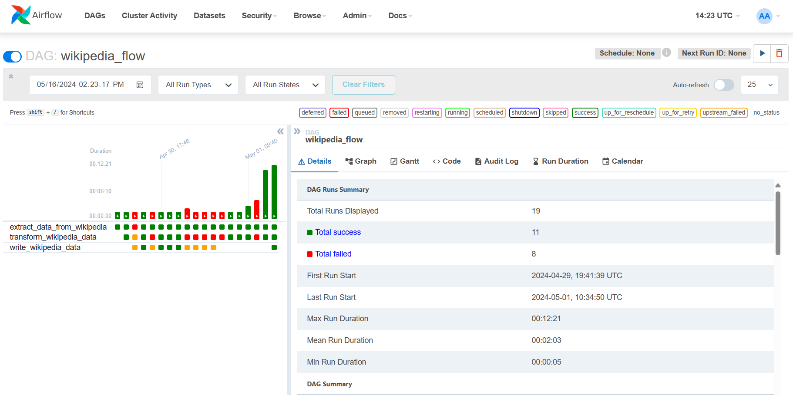
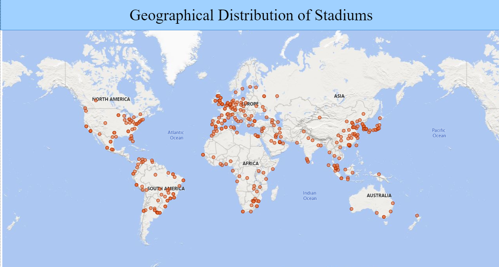

# Dự án thực hiện phân tích dữ liệu Sân vận động toàn thế giới

## Tổng quan 

- Bước 1: Tiến hành scraping dữ liệu sân vận động bóng đá từ trang wikipedia <a href="https://en.wikipedia.org/wiki/List_of_association_football_stadiums_by_capacity", target="_blank">Link web<\a>
- Bước 2: Tiễn hành phân tích dữ liệu và trasform lại theo khuôn mẫu, từ đây cũng dùng thư viện geopy để lấy tạo độ của các sân
- Bước 3: Xuất ra file dữ liệu dạng csv
- Bước 4: Set up Airflow và build lên Airflow thông qua Docker 

- Bước 5: Chạy và cập nhật vào MSSQL (chạy máy nội bộ nên tùy trường hợp máy set up tuy nhiên từ đó triển khai trên cloud) và tiến hành truy vấn

- Bước 6: Visualize dữ liệu lên Power BI.

## Công cụ
- Ngôn ngữ : Python
- Thư viện : Pandas(Dùng để phân tích dữ liệu), <a href="https://geopy.readthedocs.io/en/stable/" target="_blank">Geopy</a> (Dùng để lấy dữ liệu tọa độ)
- AirFlow để lập lịch triển khai các bước.

## Triển khai dự án

1. Clone project về máy
2. Tiến hành chạy docker-compose - `docker compose up`
3. Run - `docker-compose up --no-deps --build airflow-webserver airflow-scheduler`
